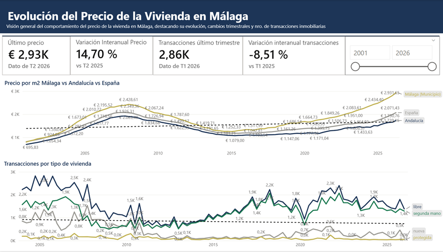

# Paola Morales

### Business Analyst · Data & Conversational AI | Python · SQL · LLMs

Ingeniera Informática con más de 15 años de experiencia en banca, bolsa de valores y fintech, especializada en análisis de datos conversacionales, diseño de chatbots con IA/NLP y automatización de procesos. Amplío este perfil hacia ingeniería de datos, machine learning y LLMs a través de proyectos propios.

📍 Málaga, España

🎓 Máster en Big Data e IA — Universidad de Málaga · Docencia completada, TFM en evaluación

---

## 🛠️ Stack técnico

---

## ⭐ Proyecto destacado

### 🏠 [datalakeUpload](https://github.com/PaoEiri/datalakeUpload) — Análisis del mercado inmobiliario de Málaga

Pipeline de datos end-to-end (ingesta → data warehouse → visualización) que analiza la evolución del precio de la vivienda en Málaga desde 2001, con datos abiertos de Tinsa, el Ministerio de Transportes y el INE.

**De €696 a €2.931 por m² en 25 años** (+14,7% solo en el último año), con diferencias de hasta el **137,83%** en 10 años entre distritos de la ciudad.

**Comparativa por distritos**
Análisis a nivel de los 11 distritos de la ciudad: Bailén-Miraflores lidera el crecimiento a 10 años (+137,83%), Campanillas el crecimiento interanual (+26,93%), y Este tiene el precio máximo actual (€3.929/m²).

**Stack:** Python · dbt · Prefect · PostgreSQL · MinIO · FastAPI · Power BI · Docker

🔗 [Ver dashboard interactivo](TU_LINK_POWERBI_PUBLISH_TO_WEB) · 📄 [Ver repositorio completo](https://github.com/PaoEiri/datalakeUpload)

---

## 📂 Otros proyectos

| Proyecto | Descripción | Stack |
|---|---|---|
| ✈️ [**travelplanner**](https://github.com/PaoEiri/travelplanner) | Planificador de viajes con IA: el usuario describe su viaje en lenguaje natural y un pipeline de agentes (RAG + planner + itinerario) genera un itinerario día a día con atracciones reales. | FastAPI · LangGraph · Ollama · ChromaDB · PostgreSQL |
| 📖 [**Cuentos Mágicos con IA**](https://github.com/PaoEiri/storybook_ai) | Aplicación de IA generativa multimodal: convierte el dibujo de un niño en el protagonista de un cuento interactivo, con texto en streaming e ilustraciones generadas en tiempo real. Arquitectura desacoplada de proveedores (Strategy + Factory). | Python · Streamlit · OpenAI · Gemini · Docker |
| 🧠 [**data-science-portfolio**](https://github.com/PaoEiri/data-science-portfolio) | Colección de proyectos de Machine Learning, Deep Learning, series de tiempo y Big Data — clasificación, clustering, transfer learning con ResNet50/VGG16, forecasting y PySpark. | Python · scikit-learn · PyTorch · PySpark · Prophet |
| ⚙️ [**revolutionary-mlops**](https://github.com/PaoEiri/MlOpsAdvance) | Pipeline de CI/CD para MLOps 100% automatizado: lint → tests → entrenamiento → validación con quality gates → despliegue de dashboard de métricas en GitHub Pages. | GitHub Actions · uv · pytest · ruff |

---

## ✅ Habilidades 

- Diseño de agentes conversacionales y pipelines LLM (LangGraph, RAG) aplicados a casos de uso reales.
- Ciclo completo de ingeniería de datos: ingesta, transformación (dbt), orquestación (Prefect) y almacenamiento en data lake/warehouse.
- Diseño y evaluación rigurosa de modelos de ML (validación cruzada, tuning de hiperparámetros, comparación de algoritmos).
- Deep learning y transfer learning aplicado a visión por computadora (PyTorch, ResNet50, VGG16).
- Desarrollo de aplicaciones de IA generativa multimodal, con arquitecturas desacopladas de proveedores y control de costes.
- Automatización de pipelines MLOps con CI/CD, quality gates y despliegue continuo.
- Procesamiento de datos a gran escala con PySpark, incluyendo streaming en tiempo real.
- Comunicación de resultados mediante dashboards y visualizaciones profesionales (Power BI).

---

[LinkedIn](https://www.linkedin.com/in/paolacmg)

